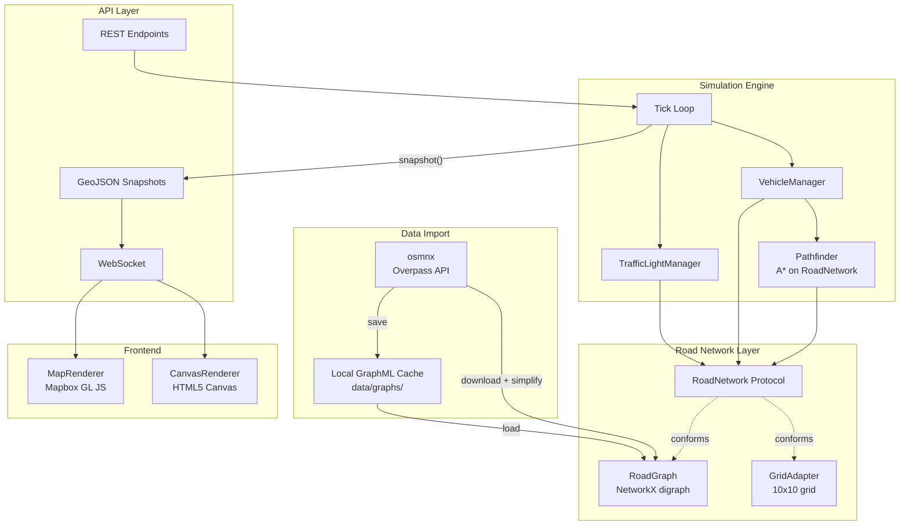
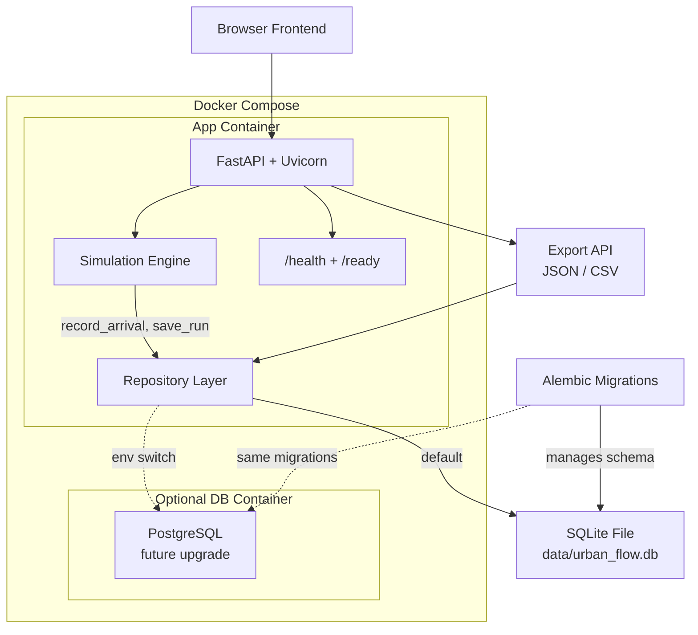
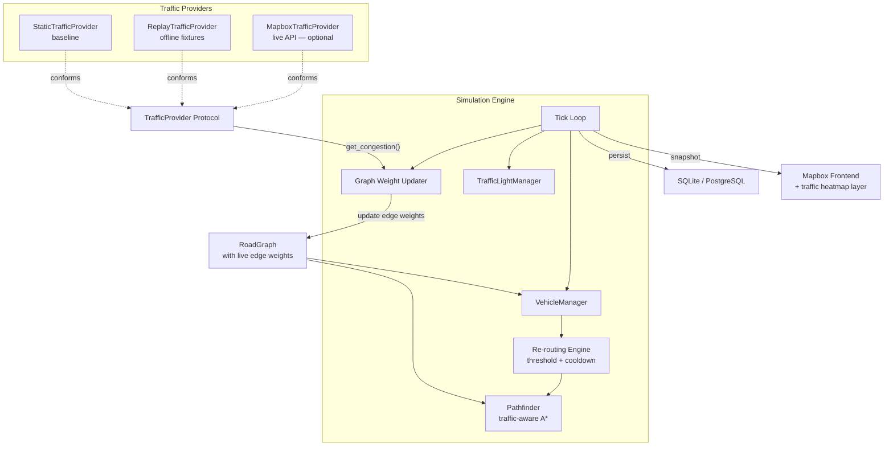
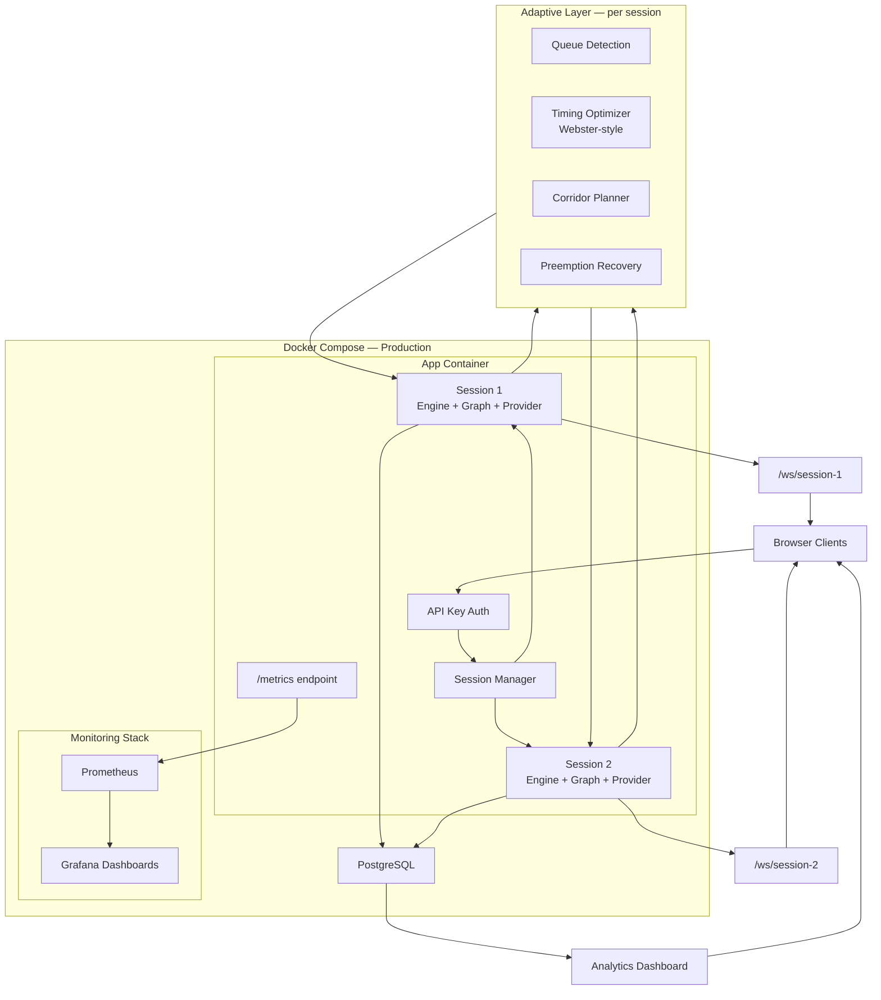

# Urban Flow — Phase 2–5 Architectural Decision Records

This document records forward-looking architectural decisions for Phases 2–5 as described in [`project_phases.md`](project_phases.md). Each decision has status **Proposed** until the corresponding phase begins implementation, at which point it moves to **Accepted** (or **Superseded** if the direction changes).

Phase 1 decisions live in [`decisions.md`](decisions.md).

---

## Phase 2: Network Abstraction + OSM Import

### Decision: Road Network Abstraction — Protocol-Based Interface

**Date:** 2026-04-16
**Status:** Proposed
**Phase:** 2 — Network Abstraction + OSM Import

**Context:** Phase 1 couples the simulation engine directly to the `Grid` class (a 2D array). Phase 2 introduces real road networks from OpenStreetMap, which are weighted directed graphs with irregular topology. The engine, pathfinder, vehicle manager, and traffic light manager all reference `Grid` today. We need a way to support both the 10x10 grid and real road graphs without forking the engine.

**Decision:** Introduce a `RoadNetwork` Python protocol (structural typing via `typing.Protocol`) that defines the simulation-facing contract. Both the existing `Grid` and the new `RoadGraph` will conform to this protocol. The engine and all downstream modules will depend on the protocol, not on concrete classes.

**Protocol surface (draft):**

```
class RoadNetwork(Protocol):
    def get_node(self, node_id) -> Node: ...
    def get_neighbors(self, node_id) -> list[Edge]: ...
    def is_traversable(self, node_id) -> bool: ...
    def is_occupied(self, node_id) -> bool: ...
    def place_vehicle(self, vehicle, node_id) -> bool: ...
    def remove_vehicle(self, node_id) -> Vehicle | None: ...
    def get_entry_points(self) -> list[Node]: ...
    def get_signal_nodes(self) -> list[Node]: ...
    def snapshot() -> dict: ...
```

**Alternatives considered:**
- **ABC (Abstract Base Class):** Explicit inheritance via `abc.ABC`. Forces `Grid` and `RoadGraph` to inherit from a shared base. More visible in type hierarchies but couples concrete implementations to an import.
- **No abstraction (if/else in engine):** Check whether the world is a grid or graph and branch accordingly. Fast to implement but spreads conditional logic throughout the codebase and makes adding a third model painful.
- **Adapter pattern only:** Wrap `Grid` in a `GridAdapter` that speaks the graph API. Viable, but a protocol is lighter — `Grid` can conform directly with minor method renames rather than an extra wrapper layer.

**Consequences:**
- (+) The simulation engine becomes topology-agnostic. Adding a new network type (e.g., hex grid, multi-floor building) only requires implementing the protocol.
- (+) Existing `Grid` tests remain valid; the grid conforms to the protocol with minimal changes (rename/alias methods).
- (+) Protocols are zero-runtime-cost in Python — no base class, no metaclass, no registration.
- (−) Protocols rely on structural typing, which `mypy` checks but the runtime does not enforce. A conformance test (or `runtime_checkable` decorator) mitigates silent drift.
- (−) The protocol must be general enough for both grids and graphs. Node IDs are `(x, y)` tuples for grids and OSM node IDs (integers) for graphs — the protocol uses a generic `NodeId` type alias.

---

### Decision: Graph Library — NetworkX via osmnx

**Date:** 2026-04-16
**Status:** Proposed
**Phase:** 2 — Network Abstraction + OSM Import

**Context:** Real road networks from OpenStreetMap are large directed graphs with metadata on nodes (coordinates, intersection type) and edges (length, speed limit, lane count, one-way flag). We need a library for graph storage, traversal, and querying.

**Decision:** Use [`osmnx`](https://osmnx.readthedocs.io/) for OSM data download and initial graph construction. `osmnx` returns `networkx.MultiDiGraph` objects. Use NetworkX as the in-process graph library for storage and traversal. Wrap it in a thin `RoadGraph` class that implements the `RoadNetwork` protocol.

**Alternatives considered:**
- **igraph:** Faster than NetworkX for large graphs (C core). However, `osmnx` outputs NetworkX graphs natively; converting to igraph adds a step and loses the tight `osmnx` integration for simplification, projection, and plotting.
- **rustworkx:** Rust-backed graph library with Python bindings. Excellent performance but smaller ecosystem and no direct `osmnx` integration.
- **Custom adjacency-list implementation:** Full control, no dependency. But re-implementing shortest-path algorithms, graph I/O, and spatial indexing is significant effort for no functional gain.

**Consequences:**
- (+) `osmnx` handles the entire OSM pipeline: download, parse, project to UTM, simplify topology, compute edge lengths. One function call produces a usable road graph.
- (+) NetworkX is the most widely used Python graph library with extensive documentation and community support.
- (+) `osmnx` provides built-in graph simplification (collapse degree-2 nodes), which reduces graph size without losing intersection topology.
- (−) NetworkX is pure Python and slower than C-backed alternatives. For city-scale graphs (10k–100k edges), pathfinding may become the bottleneck. Mitigation: profile first; if needed, switch pathfinding to a compiled library (e.g., `scipy.sparse.csgraph`) while keeping NetworkX for storage.
- (−) Adds `osmnx`, `geopandas`, and `shapely` as transitive dependencies — all heavy scientific-Python packages. Acceptable for a simulation project.

---

### Decision: OSM Data Caching — Local GraphML Files

**Date:** 2026-04-16
**Status:** Proposed
**Phase:** 2 — Network Abstraction + OSM Import

**Context:** Downloading road data from the Overpass API takes seconds to minutes depending on area size and server load. Development and testing require repeated runs on the same area. We need a caching strategy to avoid redundant downloads.

**Decision:** Cache imported graphs as GraphML files in a local `data/graphs/` directory. The cache key is a hash of the query parameters (bounding box or place name + network type). On subsequent loads, read from the local file instead of hitting the API.

**Alternatives considered:**
- **GeoJSON cache:** Export the graph as GeoJSON (nodes + edges as FeatureCollections). Human-readable and useful for frontend consumption, but lossy for graph metadata (edge directionality, multi-edge support). Would need a separate graph reconstruction step.
- **Pickle/joblib:** Fastest serialization for Python objects. But pickle files are Python-version-sensitive and not inspectable. Bad for reproducibility.
- **No cache (always download):** Simplest code path but unacceptable for developer experience on repeated runs.

**Consequences:**
- (+) GraphML is an open XML-based format that preserves full graph structure including node/edge attributes. NetworkX has native `read_graphml` / `write_graphml` support.
- (+) Cache files are version-control-friendly (can be `.gitignore`d) and inspectable with any XML viewer.
- (+) `osmnx` itself supports `save_graphml` / `load_graphml`, so integration is trivial.
- (−) GraphML files for large cities can be 10–100 MB. The `data/` directory should be in `.gitignore`.
- (−) Cache invalidation is manual (delete the file to re-download). Acceptable for a development workflow where OSM data changes infrequently.

---

### Decision: Movement Model — Distance-Based Edge Traversal

**Date:** 2026-04-16
**Status:** Proposed
**Phase:** 2 — Network Abstraction + OSM Import

**Context:** In Phase 1, vehicles move exactly 1 cell per tick. On a real road graph, edges have variable lengths (10m to 500m+). We need a movement model that handles variable-length edges while preserving the tick-based simulation loop.

**Decision:** Each edge has a **traversal cost in ticks**, computed as `ceil(edge_length / (speed_limit * tick_duration))`. A vehicle moving along an edge occupies it for that many ticks. Between ticks, the vehicle's fractional position along the edge is tracked for visualization (linear interpolation).

**Alternatives considered:**
- **Discretize edges into cells:** Break each edge into 1-cell segments. Preserves the Phase 1 "1 cell per tick" model exactly. But a 200m road at 10m/cell creates 20 intermediate nodes that exist only for movement — massive graph inflation with no topological value.
- **Continuous time (event-driven):** Abandon ticks entirely; schedule vehicle-arrival events at real-world timestamps. More realistic but requires rewriting the entire engine from a synchronous tick loop to a discrete-event simulator. Too large a change for Phase 2.
- **Fixed speed (ignore edge length):** All edges take 1 tick regardless of length. Simplest but makes the simulation physically meaningless on real roads.

**Consequences:**
- (+) Preserves the tick-based engine. Each tick still calls `engine.tick()` and produces a consistent snapshot.
- (+) Variable edge costs naturally model different road speeds (highway = fewer ticks per km, residential = more).
- (+) Fractional position tracking enables smooth vehicle animation on the frontend without changing the backend's discrete tick model.
- (−) A vehicle occupying an edge for multiple ticks is a new concept. Phase 1's "one vehicle per cell" invariant becomes "one vehicle per edge segment" — the occupancy model needs rethinking.
- (−) Tick duration gains real-world meaning (e.g., 1 tick = 1 second). This couples the simulation's temporal resolution to the road network's spatial resolution. A very short edge (5m) at 50 km/h traverses in ~0.36 seconds — less than 1 tick. Mitigation: clamp minimum traversal to 1 tick.

---

### Decision: Frontend Rendering Strategy — Provider-Neutral Data Shapes

**Date:** 2026-04-16
**Status:** Proposed
**Phase:** 2 — Network Abstraction + OSM Import

**Context:** Phase 2 introduces a map-based frontend view (Mapbox GL JS, free tier). The project's provider strategy (see `project_phases.md`) requires that the simulation core does not depend on Mapbox. We need to decide what the backend sends to the frontend and how tightly the map renderer couples to a specific vendor.

**Decision:** The backend exposes road geometry, vehicle positions, and signal state as **GeoJSON** (for spatial data) and **plain JSON** (for simulation state). The frontend has a renderer abstraction: `CanvasRenderer` for the grid view and `MapRenderer` for the map view. The `MapRenderer` starts as a Mapbox GL JS implementation but consumes only GeoJSON and simulation-state JSON — no Mapbox-specific data shapes cross the API boundary.

**Alternatives considered:**
- **Mapbox-native data format:** Send Mapbox Vector Tiles or Mapbox-specific source descriptors from the backend. Tighter coupling but potentially lower frontend work since Mapbox GL JS consumes its own formats natively.
- **Backend renders map tiles:** Use a server-side renderer (e.g., `mapnik`) to produce raster tiles. The frontend just displays images. Avoids any frontend map library dependency but loses interactivity (zoom, pan, click-on-vehicle) and is far more complex to set up.

**Consequences:**
- (+) GeoJSON is the universal interchange format for geospatial data. Any map library (Leaflet, Mapbox GL JS, MapLibre GL JS, OpenLayers, Deck.gl) can consume it directly.
- (+) Swapping Mapbox for MapLibre GL JS (the open-source fork, no token required) is a drop-in change on the frontend with no backend modifications.
- (+) The Canvas renderer for the 10x10 grid remains unchanged — it consumes the same `snapshot()` JSON it always did.
- (−) GeoJSON is verbose for large networks. For city-scale graphs with thousands of edges, sending the full road geometry every tick would be wasteful. Mitigation: send the static road geometry once on connection, then send only vehicle positions and signal states per tick (delta updates).
- (−) Frontend must transform GeoJSON into the renderer's source format on load. For Mapbox GL JS, this is a one-liner (`map.addSource('roads', { type: 'geojson', data: ... })`).

---

### Decision: Pathfinding Heuristic — Haversine for Real-World Coordinates

**Date:** 2026-04-16
**Status:** Proposed
**Phase:** 2 — Network Abstraction + OSM Import

**Context:** Phase 1 uses Manhattan distance as the A\* heuristic, which is admissible and tight for a rectangular grid with uniform cell sizes. Real road networks use geographic coordinates (latitude/longitude) or projected coordinates (UTM meters). The heuristic must be admissible on the new coordinate system.

**Decision:** Use Haversine great-circle distance as the A\* heuristic for geographic coordinates. If the graph is projected to UTM (meters), use Euclidean distance instead — it is admissible and faster to compute on projected coordinates.

**Alternatives considered:**
- **Manhattan distance on coordinates:** Not meaningful for geographic coordinates where roads do not follow a strict grid. Would overestimate for diagonal routes, violating admissibility.
- **No heuristic (Dijkstra):** Always correct but explores more nodes. On large road networks (10k+ nodes), the lack of heuristic guidance significantly increases runtime.

**Consequences:**
- (+) Haversine is admissible (never overestimates true distance) and consistent on the surface of a sphere — guarantees A\* optimality.
- (+) `osmnx` can project graphs to UTM automatically (`ox.project_graph()`), making Euclidean distance a fast and accurate alternative.
- (+) The pathfinder already parameterizes its heuristic — switching from Manhattan to Haversine/Euclidean is a function-pointer swap.
- (−) Haversine involves trigonometric functions; on very large graphs with millions of path queries, it can be a hot-spot. Mitigation: use projected coordinates (Euclidean) for performance-critical paths; Haversine only for unprojected graphs.

---

### Phase 2 High-Level Architecture



**Key structural changes from Phase 1:**
- The engine depends on `RoadNetwork` (protocol), not `Grid` (concrete class).
- Two implementations of `RoadNetwork`: `GridAdapter` wraps the existing grid; `RoadGraph` wraps a NetworkX graph built by `osmnx`.
- The API layer produces GeoJSON snapshots for the map view alongside the existing JSON snapshots for the canvas view.
- The frontend gains a `MapRenderer` that consumes GeoJSON and renders on Mapbox GL JS.

---

## Phase 3: Local Ops + Persistence

### Decision: Containerization Strategy — Docker + Compose (Local-First)

**Date:** 2026-04-16
**Status:** Proposed
**Phase:** 3 — Local Ops + Persistence

**Context:** The project needs to be reproducible across machines and eventually cloud-deployable, but the developer currently works locally without cloud subscriptions. We need a containerization approach that works for local development first and extends to cloud later.

**Decision:** Use Docker with a multi-stage Dockerfile for the Python backend, and Docker Compose for local orchestration. The Compose file defines the app service and (when needed) a database service. No cloud-specific tooling (ECS, Cloud Run, etc.) in this phase — Compose is the deployment target.

**Alternatives considered:**
- **No containers (venv only):** Continue with `uv venv` and direct `python main.py`. Zero overhead but not reproducible across machines (system Python differences, OS-level dependencies for `geopandas`/`shapely`).
- **Podman:** Drop-in Docker alternative, daemonless. Compatible with Dockerfiles. However, Docker has wider tooling support (Compose, BuildKit, IDE integrations) and the developer is likely more familiar with it.
- **Nix:** Fully reproducible builds at the system level. Steep learning curve and not widely adopted for Python web projects.

**Consequences:**
- (+) `docker compose up` gives any developer a working environment regardless of their local Python setup.
- (+) Multi-stage builds keep the production image small (no dev dependencies, no build tools).
- (+) The same image runs locally and in any cloud container service (ECS, Cloud Run, Kubernetes) with zero changes.
- (+) Compose services map directly to cloud service definitions later.
- (−) Adds Docker as a development dependency. Mitigation: keep the `uv run python main.py` path working for developers who prefer bare-metal.
- (−) File watching and hot-reload inside containers requires bind mounts and `--reload` flags. Acceptable complexity.

---

### Decision: Primary Database — SQLite (Local-First, PostgreSQL-Compatible Schema)

**Date:** 2026-04-16
**Status:** Proposed
**Phase:** 3 — Local Ops + Persistence

**Context:** Phase 3 introduces persistence for simulation runs, metrics history, and comparison data. The developer works locally and does not want to manage a database server for development. However, the project should be portable to PostgreSQL for future cloud deployments.

**Decision:** Use SQLite as the primary local database. Design the schema and data-access layer using SQLAlchemy 2.x with Alembic migrations, targeting the common SQL subset that works on both SQLite and PostgreSQL. Switch to PostgreSQL by changing the connection string in the environment configuration.

**Alternatives considered:**
- **PostgreSQL from the start:** More realistic for production but requires running a database server (even in Docker) for every development session. Overhead disproportionate to a single-developer project at this stage.
- **JSON files:** Persist simulation runs as JSON documents in a `data/runs/` directory. Zero dependencies. But querying across runs (e.g., "show me all runs on area X with improvement > 20%") requires custom parsing logic that a SQL database gives for free.
- **Redis:** In-memory with optional persistence. Good for caching and pub/sub but not for structured historical queries. Adds an external service dependency.

**Consequences:**
- (+) SQLite is zero-configuration — it is a file on disk, no server process, no connection pooling.
- (+) SQLAlchemy 2.x with Alembic provides dialect-portable migrations. The same migration files generate valid SQL for both SQLite and PostgreSQL.
- (+) Async SQLite access is possible via `aiosqlite` (SQLAlchemy async engine with `sqlite+aiosqlite://` URL), keeping consistency with the asyncio event loop.
- (−) SQLite lacks some PostgreSQL features (e.g., array columns, `JSONB`, concurrent writes from multiple processes). The schema must stay within the common subset.
- (−) SQLite has a single-writer lock. Not an issue for a single-process simulation but becomes a limitation if multi-session support (Phase 5) needs concurrent write access. At that point, upgrade to PostgreSQL.

---

### Decision: Data Access Layer — SQLAlchemy 2.x Async + Alembic

**Date:** 2026-04-16
**Status:** Proposed
**Phase:** 3 — Local Ops + Persistence

**Context:** The simulation engine runs on an asyncio event loop. Database access must not block the event loop. We need an ORM or query builder that supports async operations and portable migrations.

**Decision:** Use SQLAlchemy 2.x in async mode (via `create_async_engine`) with Alembic for schema migrations. Define domain models as SQLAlchemy ORM mapped classes. Use the repository pattern to isolate database queries from simulation logic.

**Alternatives considered:**
- **Raw `aiosqlite` / `asyncpg`:** Direct async database drivers without an ORM. Maximum performance and control but requires hand-written SQL for every query and manual migration management.
- **Tortoise ORM:** Async-first Python ORM inspired by Django. Lighter than SQLAlchemy but smaller community, fewer migration tools, and less dialect portability.
- **SQLModel:** Built on SQLAlchemy + Pydantic. Attractive for FastAPI projects (shared Pydantic models). But SQLModel is less mature, and mixing Pydantic request/response models with ORM persistence models often leads to awkward coupling.

**Consequences:**
- (+) SQLAlchemy 2.x has first-class async support and is the most mature Python ORM.
- (+) Alembic auto-generates migration scripts from model changes, reducing manual migration effort.
- (+) The repository pattern keeps database queries behind a clean interface. The simulation engine never imports SQLAlchemy — only the persistence layer does.
- (−) SQLAlchemy has a significant API surface. For a project with a small schema (3–5 tables), it may feel heavy. Acceptable given the long-term portability benefit.
- (−) Alembic migration workflows require discipline (generate, review, apply). A Makefile target (`make db-migrate`) can simplify this.

---

### Phase 3 High-Level Architecture



**Key structural changes from Phase 2:**
- A repository layer sits between the engine and the database. The engine calls `repo.save_run()` or `repo.record_arrival()` — it never touches SQL directly.
- SQLite is the default backend; PostgreSQL is a connection-string swap.
- The application runs inside Docker via `docker compose up`, but `uv run python main.py` still works for bare-metal development.
- `/health` provides liveness checks; `/ready` gates on database connectivity.
- Export endpoints (`GET /api/runs`, `GET /api/runs/{id}/metrics`) query the repository for historical data.

---

## Phase 4: Live Traffic Integration

### Decision: Traffic Data Abstraction — Provider Interface with Local Replay Default

**Date:** 2026-04-16
**Status:** Proposed
**Phase:** 4 — Live Traffic Integration

**Context:** Phase 4 introduces changing traffic conditions that affect edge weights in the road graph. The project's provider strategy mandates that the simulation core does not depend on a specific traffic data vendor. Development and testing must work fully offline.

**Decision:** Define a `TrafficProvider` protocol with a single method: `get_congestion(edge_ids: list[EdgeId]) -> dict[EdgeId, CongestionLevel]`. Implement three providers:

1. **`StaticTrafficProvider`** — returns a fixed congestion level for all edges (useful for baseline testing).
2. **`ReplayTrafficProvider`** — reads pre-recorded congestion snapshots from a local JSON/CSV file and plays them back at configurable speed.
3. **`MapboxTrafficProvider`** (optional) — polls the Mapbox Traffic API and maps responses to `CongestionLevel` values.

The engine's graph-weight updater calls the active provider at a configurable interval and updates edge weights accordingly.

**Alternatives considered:**
- **Hardcode Mapbox integration:** Directly call the Mapbox API from the engine. Fastest to implement but violates the provider-neutral strategy and makes offline development impossible without mocking.
- **Event-sourced traffic stream:** Traffic changes arrive as an event stream (e.g., Kafka, Redis Streams) that the engine subscribes to. More realistic for production but introduces infrastructure dependencies far beyond what a solo local project needs.

**Consequences:**
- (+) Development and CI run fully offline using `ReplayTrafficProvider` — no API keys, no network calls.
- (+) Adding a new provider (HERE, TomTom, Google) requires implementing one method.
- (+) The replay provider enables deterministic testing: the same traffic file produces the same simulation every time.
- (−) The `CongestionLevel` abstraction (e.g., `free_flow | low | moderate | heavy | severe`) loses provider-specific nuance (exact speed, incident data, road closures). Acceptable for a simulation focused on signal preemption, not traffic analytics.
- (−) Replay files must be created or recorded. Mitigation: provide a script that fetches current Mapbox traffic for a cached graph and saves it as a replay file.

---

### Decision: Dynamic Re-Routing — Threshold-Based with Cooldown

**Date:** 2026-04-16
**Status:** Proposed
**Phase:** 4 — Live Traffic Integration

**Context:** Phase 1 pre-computes vehicle paths at spawn time and never changes them. Phase 4 introduces changing traffic conditions, which can make a pre-computed path significantly suboptimal. We need to decide when and how vehicles re-route.

**Decision:** After each traffic data update, compute the cost of each vehicle's remaining path under the new edge weights. If the new cost exceeds the original cost by more than a configurable threshold (default: 50%), trigger a re-route for that vehicle. Apply a cooldown (default: 10 ticks) to prevent oscillation. Emergency vehicles have a lower re-route threshold (default: 25%) since their travel time is critical.

**Alternatives considered:**
- **Re-route every vehicle on every traffic update:** Guarantees optimal paths but is computationally expensive (pathfinding for every active vehicle every 60–120 seconds). On a city-scale graph with hundreds of vehicles, this could spike CPU.
- **Never re-route (Phase 1 model):** Simplest but makes live traffic integration pointless — vehicles would ignore congestion changes entirely.
- **Re-route only emergency vehicles:** Reduces computation but normal vehicles would still follow stale paths through congested areas, creating unrealistic behavior.

**Consequences:**
- (+) Threshold-based re-routing limits computation to vehicles that are actually affected by traffic changes.
- (+) Cooldown prevents rapid path oscillation when two routes alternate as "best."
- (+) Emergency vehicles' lower threshold prioritizes their responsiveness to traffic changes.
- (−) The threshold is a tuning parameter. Too high = vehicles ignore meaningful changes; too low = too many re-routes. Will need empirical tuning once live traffic is integrated.
- (−) Re-routing changes a vehicle's remaining path mid-journey, which means the frontend must handle path updates gracefully (smooth transition, not a visual "jump").

---

### Decision: Tick-to-Real-Time Mapping

**Date:** 2026-04-16
**Status:** Proposed
**Phase:** 4 — Live Traffic Integration

**Context:** Phase 1's tick has no real-world time meaning — it is an abstract discrete step. Phase 4 introduces live traffic data that is timestamped in real-world seconds. We need a mapping between simulation ticks and real-world time to correctly compute edge traversal costs and synchronize with traffic updates.

**Decision:** Introduce a `tick_duration_seconds` configuration parameter (default: 1.0). One simulation tick represents `tick_duration_seconds` seconds of real-world time. Edge traversal ticks are computed as `ceil(edge_length_meters / (effective_speed_mps * tick_duration_seconds))`. Traffic data refreshes are aligned to tick counts: e.g., "refresh every 60 ticks" at 1 second/tick = refresh every 60 seconds.

**Alternatives considered:**
- **Continuous real-time (wall-clock):** Each tick maps to actual elapsed wall-clock time. The simulation runs "in real time." More intuitive but prevents fast-forward (the user can't run 1 hour of traffic in 5 minutes).
- **No mapping (abstract ticks):** Keep ticks abstract. Translate traffic data into abstract "congestion multipliers" with no temporal grounding. Simpler but makes it impossible to validate simulation results against real-world travel-time data.

**Consequences:**
- (+) Configurable tick duration allows both real-time simulation (1 tick = 1 second, tick speed = 1) and accelerated runs (1 tick = 1 second, tick speed = 10 = 10x faster than real time).
- (+) Edge traversal costs become physically meaningful: a 500m road at 50 km/h (~14 m/s) takes `ceil(500 / 14) = 36 ticks` at 1s/tick, which is ~36 seconds — matching real-world expectations.
- (+) Traffic refresh intervals are tick-aligned, avoiding clock-drift issues between the simulation loop and the traffic-polling loop.
- (−) Changing `tick_duration_seconds` mid-run changes the physical meaning of all existing edge costs. Mitigation: treat it as a scenario parameter set before the run starts, not a runtime-tunable.
- (−) Very short edges (< `effective_speed * tick_duration`) clamp to 1-tick traversal, creating a temporal resolution floor. Acceptable for road networks where minimum edge length is typically 10+ meters.

---

### Phase 4 High-Level Architecture



**Key structural changes from Phase 3:**
- A `TrafficProvider` protocol abstracts all traffic data sources. The engine only sees `get_congestion()`.
- `ReplayTrafficProvider` is the default for development — fully offline, deterministic.
- The graph weight updater runs at a configurable tick interval, mapping congestion levels to edge-weight multipliers.
- The re-routing engine monitors remaining-path costs and triggers A\* recomputation when the threshold is exceeded.
- The frontend gains a traffic heatmap layer (color-coded edges by congestion).

---

## Optional Phase 5: Adaptive Optimization + Production Scale

### Decision: Adaptive Signal Algorithm — Demand-Responsive Timing (Rule-Based)

**Date:** 2026-04-16
**Status:** Proposed
**Phase:** 5 (Optional) — Adaptive Optimization

**Context:** Phases 1–4 use fixed-cycle traffic lights (equal phase durations per axis, configurable but static during a run). Phase 5 introduces adaptive signal timing that responds to real-time traffic demand. The project scope explicitly excludes heavy ML — the algorithm should be rule-based.

**Decision:** Implement a demand-responsive timing algorithm inspired by Webster's optimal cycle formula. Each intersection independently adjusts its green-phase durations based on the ratio of approaching vehicle queues on each axis. The algorithm runs once per signal cycle (not every tick) and adjusts the next cycle's phase durations within configurable bounds.

**Algorithm sketch:**
1. At the end of each signal cycle, count vehicles within N edges of the intersection on each approach (queue proxy).
2. Compute demand ratio: `r = queue_NS / (queue_NS + queue_EW)` (clamped to `[0.2, 0.8]` to prevent axis starvation).
3. Allocate green time proportionally: `green_NS = r * total_green_budget`, `green_EW = (1 - r) * total_green_budget`.
4. Apply min/max bounds to each phase duration (e.g., 2–10 ticks).

**Alternatives considered:**
- **SCOOT/SCATS-style coordination:** Centralized adaptive control that coordinates signal timing across multiple intersections to create "green waves." More effective but requires a central coordinator, inter-intersection communication, and significantly more complexity.
- **Reinforcement learning:** Train an RL agent to optimize signal timing. Potentially better long-term performance but requires training infrastructure, reward function design, and stability engineering far beyond the current project scope.
- **Fixed time-of-day profiles only:** Pre-program 3–4 timing profiles (morning, midday, evening, night) and switch on a schedule. Simpler than demand-responsive but does not react to actual conditions.

**Consequences:**
- (+) Each intersection optimizes independently — no central coordinator, no inter-intersection messaging.
- (+) The algorithm is deterministic given the same queue counts — easy to test and debug.
- (+) Bounded phase durations prevent pathological timing (e.g., one axis starving indefinitely).
- (+) Runs once per cycle (every 24 ticks at default settings), so computational overhead is negligible.
- (−) Independent optimization per intersection can create conflicting timing on adjacent intersections ("green wave" opportunities are missed). Acceptable as a first step; coordinated control can be layered on later.
- (−) Queue estimation via edge vehicle counts is a rough proxy. Vehicles far from the intersection but on the same edge are counted equally to vehicles at the stop line. Acceptable given the simulation's level of abstraction.

---

### Decision: Multi-Session Architecture — In-Process Session Manager

**Date:** 2026-04-16
**Status:** Proposed
**Phase:** 5 (Optional) — Adaptive Optimization + Production Scale

**Context:** Phases 1–4 run a single simulation instance. Phase 5 adds multi-session support so multiple users (or the same user) can run independent simulations simultaneously. We need to decide how sessions are isolated and managed.

**Decision:** Use an in-process session manager that maps session IDs to independent `SimulationEngine` instances. Each session has its own engine, road network, traffic provider, and WebSocket channel. The session manager is a singleton held by the FastAPI app. REST endpoints accept a `session_id` parameter; WebSocket connections are scoped to a session via the URL path (`/ws/{session_id}`).

**Alternatives considered:**
- **One process per session:** Spawn a new Python process for each session. Full memory isolation but significant overhead (process startup, IPC for control commands, port management).
- **Celery/task queue:** Offload simulation ticks to Celery workers. Adds Redis/RabbitMQ as a broker dependency and complicates the real-time WebSocket flow (workers can't push to WebSocket directly).
- **Kubernetes-based scaling:** One pod per session. Full isolation and horizontal scaling but requires Kubernetes infrastructure — premature for a project that doesn't yet need multi-instance deployment.

**Consequences:**
- (+) Simplest implementation — sessions are Python objects in a dictionary. No IPC, no external services.
- (+) WebSocket scoping by URL path is a natural fit for FastAPI's routing.
- (+) Memory-efficient for a small number of sessions (< 10). Each engine + graph is ~10–50 MB depending on the road network.
- (−) All sessions share one Python process and one asyncio event loop. A computationally heavy session (very large graph, many vehicles) can slow down others. Mitigation: `asyncio.to_thread()` for tick computation; session-level tick budgets.
- (−) No memory isolation — a bug in one session's engine could corrupt shared state. Mitigation: sessions are fully independent objects with no shared mutable state.
- (−) Single-process limit caps total throughput. If the project grows to dozens of concurrent sessions, the move to multi-process or Kubernetes-based isolation becomes necessary.

---

### Decision: Monitoring Strategy — Prometheus Metrics Endpoint

**Date:** 2026-04-16
**Status:** Proposed
**Phase:** 5 (Optional) — Adaptive Optimization + Production Scale

**Context:** Phase 5 targets production readiness. We need observability beyond application logging: real-time metrics for tick latency, active sessions, vehicle counts, pathfinding durations, and API response times.

**Decision:** Expose a Prometheus-compatible `/metrics` endpoint using the `prometheus-client` Python library. Define custom metrics (counters, gauges, histograms) for simulation-specific measurements. Optionally deploy Grafana (via Docker Compose) for dashboarding.

**Alternatives considered:**
- **Application-only logging + log aggregation (ELK/Loki):** Structured JSON logs with metrics extracted via log queries. Sufficient for debugging but poor for real-time dashboarding and alerting.
- **OpenTelemetry:** Vendor-neutral observability framework covering metrics, traces, and logs. More comprehensive than Prometheus alone but significantly more setup (collector, exporters, trace propagation). Overkill for a single-service project.
- **Custom `/stats` JSON endpoint:** Expose metrics as a plain JSON response. No external dependencies. But loses the entire Prometheus ecosystem (Grafana dashboards, alert rules, long-term storage).

**Consequences:**
- (+) Prometheus is the de-facto standard for container monitoring. Grafana integration is trivial.
- (+) `prometheus-client` is lightweight (one dependency, no background threads) and integrates cleanly with FastAPI.
- (+) Metrics are pull-based — the app just exposes an endpoint. No push infrastructure needed.
- (+) Pre-built Grafana dashboards for FastAPI/Uvicorn exist and can be extended with simulation-specific panels.
- (−) Prometheus requires a running Prometheus server to scrape and store metrics. In Docker Compose, this is one additional service. For local-only development, the `/metrics` endpoint can be inspected manually via `curl`.
- (−) Histogram metrics (e.g., tick-duration distribution) add a small per-tick overhead. Negligible for the expected scale.

---

### Phase 5 High-Level Architecture



**Key structural changes from Phase 4:**
- A `SessionManager` maps session IDs to independent engine instances. REST and WebSocket routes are session-scoped.
- Each session's `TrafficLightManager` delegates to the adaptive timing optimizer at the end of each signal cycle.
- The corridor planner pre-computes green corridors for emergency vehicles, coordinating preemption across multiple intersections on the planned route.
- PostgreSQL replaces SQLite as the default database (concurrent writes from multiple sessions).
- Prometheus scrapes the `/metrics` endpoint; Grafana provides dashboards for tick latency, session count, vehicle throughput, and adaptive-timing effectiveness.
- Basic API-key authentication gates access to session creation and control endpoints.
