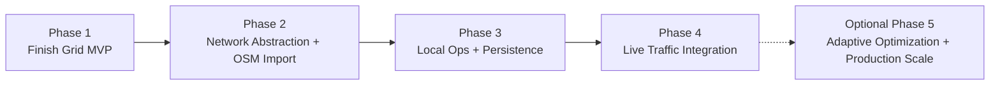
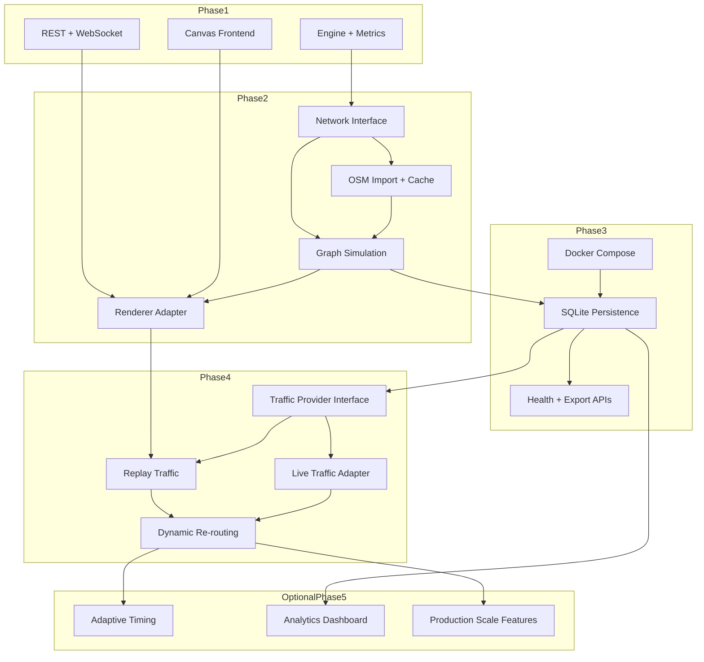

# Urban Flow — Project Phases

## Overview

Urban Flow is a modular traffic-signal and emergency-response simulation platform. It starts with a deterministic 10x10 grid simulation and evolves toward **real-road simulation with traffic-aware emergency preemption**.

This roadmap is intentionally optimized for a solo, local-first workflow:

- Every phase must produce something demonstrable on a local machine.
- The core simulation should stay provider-agnostic so paid APIs can be added later without rewriting the domain model.
- Cloud-ready means reproducible containers, clean configuration boundaries, and portable persistence before it means Kubernetes.

**Current status (April 2026):** foundational Phase 1 modules are implemented and unit-tested: `Grid`, `Pathfinder`, `Vehicle` / `VehicleManager`, and the single-intersection `TrafficLight`. The runnable application path is still incomplete: `TrafficLightManager`, `Metrics`, `SimulationEngine`, REST/WebSocket wiring, app startup, and the browser frontend are not finished yet.

The 10x10 grid remains a permanent sandbox mode even after real-road support lands. Later phases extend the simulation rather than replacing the original Phase 1 workflow.

## Provider Strategy

- **Road-network source of truth:** OpenStreetMap-derived graph data cached locally. Core simulation logic should not depend on Mapbox or any single vendor.
- **Map rendering:** It is fine to use free Mapbox rendering first, but the frontend should consume provider-neutral data shapes such as GeoJSON or simulation snapshots so the renderer can be swapped later.
- **Traffic data:** Start with recorded or synthetic traffic datasets that run locally. Add hosted live providers behind adapters once the local replay path works.

---

## Phase 1: Finish Grid Simulation MVP

> **Goal:** Get the 10x10 grid simulation fully working end-to-end with a browser-based UI.

### Status

In progress. The domain model is partially complete, but the end-to-end app is not yet runnable.

### Objectives

1. Complete the remaining backend integration work so the simulation runs autonomously.
2. Build the browser frontend for real-time visualization and control.
3. Deliver all 8 user stories from `requirements.md`.
4. Validate the emergency-vehicle preemption model with measurable metrics.

### Key Deliverables

#### Backend (remaining work, aligned to `docs/tasks.md`)

| Task ID | Slice | Description |
|---------|-------|-------------|
| P1-TL-02 | TrafficLightManager + grid light wiring | Create all intersection lights, expose lookup helpers, bridge movement permission checks, update phase duration, and snapshot traffic-light state |
| P1-MET-01 | Metrics module complete | Finish KPI calculations, arrival recording, reset behavior, and serialization for API/frontend use |
| P1-ENG-01 | SimulationEngine complete | Finish initialization, the six-phase tick loop, config setters, preemption orchestration, cleanup, and frontend-ready snapshots |
| P1-API-02 | Runtime interface layer | Complete REST route wiring, WebSocket broadcasting/commands, FastAPI bootstrap, CORS, static-file serving, and startup lifecycle |
| P1-ENG-04 | Road segment scheduler foundation | Derive road segments, persist normal requests, apply deterministic normal-direction fairness, and represent committed intersection-crossing grants |
| P1-ENG-05 | Emergency segment priority | Prioritize emergency requests, coordinate segment reservations with signal preemption, and release stale reservations |
| P1-ENG-06 | Spawn demand and capacity admission | Enforce capacity and emergency reserve, pause spawning on zero movement, transactionally arbitrate spawn entry, and add spawn accounting |
| P1-ENG-07 | Admission-aware engine integration, liveness, and regression | Integrate admission-aware movement, snapshots, liveness telemetry, reset behavior, and regression coverage |

#### Frontend

| Task ID | Slice | Description |
|---------|-------|-------------|
| P1-FE-01 | Browser MVP | Depends on `P1-ENG-07`; deliver the full browser UI: `index.html`, canvas rendering, controls, metrics panel, WebSocket lifecycle, and end-to-end interaction with the running backend |

#### Quality Gates

- Existing unit tests stay green.
- Add focused tests for engine tick orchestration and API wiring.
- Manually verify all 8 Phase 1 user stories.
- CI remains green for linting and tests.

### Technical Details

- **Backend:** Python 3.12+, FastAPI, Uvicorn, Pydantic v2
- **Frontend:** Vanilla JS + HTML5 Canvas, with no required build step
- **Transport:** WebSocket for real-time ticks, REST for control and fallback queries
- **Persistence:** In-memory only

### Definition of Done

- `uv run python main.py` or `make run` starts the server.
- Opening `http://localhost:8000` shows the running simulation.
- Vehicles spawn, navigate, wait correctly, and arrive.
- Traffic lights cycle through all four phases and support emergency preemption with visible yellow transitions.
- Pause/resume, speed, spawn rate, and phase duration controls work in real time.
- Metrics show whether emergency vehicles are outperforming normal vehicles.

### References

- Task tracker: [`tasks.md`](tasks.md)
- Architecture: [`architecture.md`](architecture.md)
- ADRs: [`decisions.md`](decisions.md)

---

## Phase 2: Network Abstraction + OSM Import

> **Goal:** Introduce a simulation-facing road-network abstraction and run the engine on OpenStreetMap-backed road graphs while keeping the grid sandbox intact.

### Objectives

1. Remove direct `Grid` assumptions from the simulation boundary so both grid and graph models are possible.
2. Import real road networks from OpenStreetMap for user-selected areas.
3. Keep map rendering pluggable instead of hard-coding the core model to Mapbox.
4. Preserve the 10x10 grid as a fast regression and sandbox mode.

### Key Deliverables

#### Core Abstraction

| Deliverable | Description |
|-------------|-------------|
| Network interface | Introduce a simulation-facing abstraction for traversable nodes, edges, occupancy, and traffic-control lookups |
| Grid adapter | Wrap the existing 10x10 grid so it conforms to the shared network interface |
| Graph model | Weighted directed graph with intersections as nodes and road segments as edges |
| Pathfinding refactor | Move from `Pathfinder.find_path(grid, ...)` to pathfinding over the shared network abstraction |

#### Real-Road Support

| Deliverable | Description |
|-------------|-------------|
| OSM importer | Load road-network data from OpenStreetMap using `osmnx` |
| Local cache | Persist imported graphs locally as GraphML/GeoJSON to avoid repeated downloads |
| Graph simulation | Run vehicle movement and signal logic against the imported graph |
| Compatibility mode | Keep the original grid mode available behind the same engine-facing contract |

#### Visualization Boundary

| Deliverable | Description |
|-------------|-------------|
| Provider-neutral map payloads | Backend exposes road geometry, vehicle positions, and signal state in renderer-friendly formats |
| Initial renderer adapter | Start with one real-map renderer implementation, such as free Mapbox rendering or an open-source equivalent |
| Dual-mode UX | Keep grid view and add a real-road mode once graph simulation works end-to-end |

### Technical Details

- **Road data:** OpenStreetMap via [`osmnx`](https://osmnx.readthedocs.io/)
- **Graph operations:** NetworkX plus a simulation-specific wrapper layer
- **Rendering strategy:** Renderer adapter consumes provider-neutral payloads; map vendor is a frontend concern, not a simulation concern
- **Pathfinding:** Real-road edge weights derive from distance, speed limit, directionality, and signal cost

### Key Decisions

- **Movement model:** Use distance-based edge traversal rather than discretizing every road segment into grid-like cells.
- **Caching:** Cache imported graphs locally and treat remote fetching as a setup step, not a runtime dependency.
- **Lane modeling:** Keep lane count as graph metadata for future use, but do not block this phase on full multi-lane behavior.

### Dependencies

- Phase 1 must be complete.
- New Python packages: `osmnx`, `geopandas`, `shapely`

### Definition of Done

- User can load a real road network from OpenStreetMap by city name or bounding box.
- The engine can run against both the original grid and the imported road graph.
- Imported graphs are cached locally for repeatable development runs.
- A real-map renderer can visualize the graph simulation, but the simulation core does not depend on a specific provider.

---

## Phase 3: Local Ops + Persistence

> **Goal:** Make the project reproducible, portable, and comparable on a single machine before introducing live provider dependencies.

### Objectives

1. Add minimal containerization and environment management for local development and future deployment.
2. Persist simulation runs and metric summaries in a local-first way.
3. Add basic health/readiness behavior appropriate for containerized workflows.
4. Preserve deterministic, replayable runs for before/after comparisons.

### Key Deliverables

#### Local Ops

| Deliverable | Description |
|-------------|-------------|
| Dockerfile | Multi-stage backend image for reproducible local and future cloud runs |
| `docker-compose.yml` | Local orchestration for the app and optional supporting services |
| `.env.example` | Document expected environment variables without checking in secrets |
| Health endpoint | `/health` for lightweight liveness checks; add `/ready` once optional dependencies exist |

#### Persistence

| Deliverable | Description |
|-------------|-------------|
| SQLite default | Local-first persistence for simulation runs, configs, and metrics history |
| PostgreSQL compatibility path | Keep the schema and data-access layer portable so a PostgreSQL deployment can be added later |
| Run metadata | Persist scenario config, timestamps, random seed, and source-network identifiers |
| Replay support | Store enough run metadata and snapshots to reproduce comparisons locally |

#### Developer Workflow

| Deliverable | Description |
|-------------|-------------|
| Compose-based local run | `docker compose up` works without requiring a cloud account |
| Export endpoints | Query past runs and export summaries as JSON/CSV |
| Migration tooling | Use a migration-capable data layer so SQLite and PostgreSQL stay aligned |

### Technical Details

- **Primary local database:** SQLite
- **Portable data layer:** SQLAlchemy 2.x plus Alembic-compatible migrations
- **Optional deploy target:** PostgreSQL using the same schema model
- **Container base:** Python 3.12 slim image

### Dependencies

- Phase 2 must be complete.
- New Python packages: `sqlalchemy`, `alembic`

### Definition of Done

- The app still runs with `uv run python main.py`, and it also runs with `docker compose up`.
- `/health` reports basic liveness, and `/ready` is added once DB-backed dependencies are wired.
- Simulation runs and summary metrics persist locally in SQLite.
- The persistence layer can be pointed at PostgreSQL later without redesigning the domain model.

---

## Phase 4: Live Traffic Integration

> **Goal:** Feed changing traffic conditions into the real-road simulation and make live-traffic scenarios the final core milestone.

### Objectives

1. Add a provider boundary for traffic inputs.
2. Support local replay and synthetic traffic scenarios before depending on hosted live feeds.
3. Update graph edge weights from changing traffic conditions.
4. Enable mid-journey rerouting when traffic changes justify it.

### Key Deliverables

#### Traffic Input Layer

| Deliverable | Description |
|-------------|-------------|
| Traffic provider interface | Shared contract for replayed, synthetic, and hosted traffic sources |
| Local replay pack | Recorded or synthetic traffic fixtures that can run fully offline |
| Hosted provider adapter | Optional live adapter for providers such as Mapbox Traffic once needed |

#### Simulation Adaptations

| Deliverable | Description |
|-------------|-------------|
| Graph weight updater | Map changing congestion data onto edge weights |
| Traffic-aware pathfinding | Extend cost functions to account for live traffic conditions |
| Re-routing engine | Recompute routes when congestion materially changes the remaining path |
| Time alignment | Define how simulation ticks map to traffic-update intervals |

#### Visualization

| Deliverable | Description |
|-------------|-------------|
| Traffic layer | Color-coded congestion overlay on the map |
| Route visibility | Show traffic-aware paths and optionally completed path trails |
| Comparative metrics | Persist and display enough data to compare preemption under different traffic states |

### Technical Details

- **Offline-first development:** local replay should be the default path for development and testing
- **Hosted refresh cadence:** poll hosted providers at a bounded interval, then interpolate between updates as needed
- **Performance focus:** profile large graphs before adding heavier routing optimizations

### Dependencies

- Phase 3 must be complete.
- Optional hosted-provider credentials only when live adapters are enabled

### Definition of Done

- A real-road simulation can run against changing traffic conditions.
- The full feature can be demonstrated locally using replayed traffic data.
- A hosted live-traffic provider can be enabled through configuration, but it is not required for development.
- Emergency vehicles can re-route dynamically when traffic conditions worsen on the remaining path.

---

## Optional Phase 5: Adaptive Optimization + Production Scale

> **Goal:** Add rule-based adaptive signal timing, richer analytics, and production-scale deployment features after live traffic is already working.

### Objectives

1. Implement rule-based adaptive signal optimization.
2. Improve emergency-routing coordination on live road graphs.
3. Add historical analytics and comparison tooling.
4. Add production-scale capabilities only when they are actually needed.

### Key Deliverables

#### Adaptive Control

| Deliverable | Description |
|-------------|-------------|
| Queue detection | Estimate intersection demand from nearby vehicles or edge occupancy |
| Demand-responsive timing | Adjust green duration based on queue ratios and bounded timing rules |
| Preemption recovery | Return from emergency preemption into a recomputed cycle rather than a naive fixed reset |
| Corridor planning | Build and score green corridors for emergency vehicles |

#### Analytics

| Deliverable | Description |
|-------------|-------------|
| Historical dashboard | Compare prior runs, traffic conditions, and signal strategies |
| Run comparison | Side-by-side metrics for fixed timing vs adaptive timing |
| Export | CSV/JSON export for offline analysis |

#### Production Scale

| Deliverable | Description |
|-------------|-------------|
| Multi-session support | Multiple independent simulations per deployment |
| Auth | Basic API protection for shared deployments |
| Structured logging | JSON logs with session correlation IDs |
| Monitoring | Prometheus-compatible metrics and optional Grafana dashboards |
| Kubernetes | Optional manifests or Helm chart once multi-instance deployment is warranted |

### Technical Details

- **Adaptive algorithm:** Webster-style or other rule-based control, not ML by default
- **Production hardening order:** Compose first, then readiness/logging, then monitoring, then Kubernetes only if deployment scale requires it

### Dependencies

- Phase 4 must be complete.

### Definition of Done

- Adaptive signal timing improves or at least matches fixed timing under repeatable test scenarios.
- Historical comparisons are possible across runs and strategies.
- The application can scale beyond a single local session when there is a real deployment reason to do so.

---

## Technology Summary Across Phases

| Concern | Phase 1 | Phase 2 | Phase 3 | Phase 4 | Optional Phase 5 |
|---------|---------|---------|---------|---------|------------------|
| Road model | 10x10 2D grid | Shared network abstraction + OSM graph | Same | + live traffic weights | + adaptive queue/demand data |
| Data source | Hardcoded city-block layout | OpenStreetMap + local graph cache | + persisted runs | + replayed or hosted traffic providers | + historical analytics inputs |
| Frontend | Vanilla JS + Canvas | + pluggable map renderer | Same | + traffic overlays | + analytics dashboard |
| Pathfinding | A* on grid cells | A* on shared network model | Same | + traffic-aware re-routing | + corridor planning / optimization |
| Persistence | In-memory only | Cached graphs only | SQLite first, PostgreSQL-compatible | + traffic/run history | + multi-session analytics state |
| Deployment | Local Python process | Local Python process | + Docker Compose + health checks | Same + optional provider credentials | + monitoring, auth, optional Kubernetes |
| Signal logic | Fixed-cycle + preemption | Same on graph intersections | Same | Same with live-traffic context | + rule-based adaptive timing |

---

## Phase Dependencies

